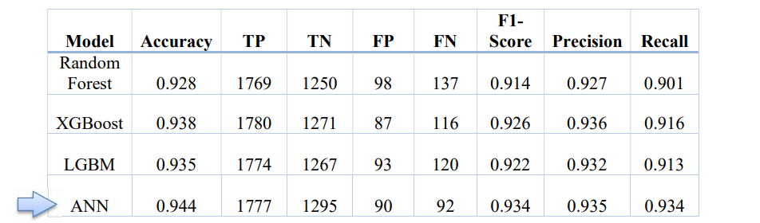
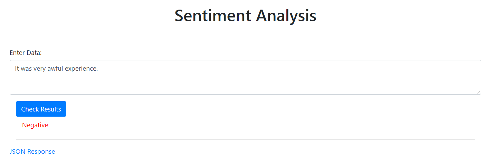
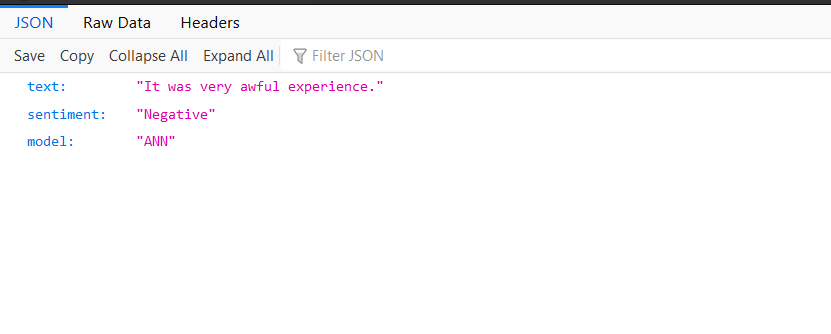

# Sentiment Analysis API

###### By Author Sameer Sharma
---
Sentiment Analysis API is designed to predict the sentiment on the text given through POST method. The response will be in the form of JSON object which can be easily used in any application.

**Code Files**: Refer to 
1. [**'Project\Application\Model.ipynb'**]('https://github.com/sameersharma1999/Airline-Sentiment-Analysis/blob/main/Project/Application/Model.ipynb') for detailed explanation of how data cleaning, augmentation, preprocessing, Model building and testing has been done.
2. [**'Project\server\SentimentAnalysis.py'**]('https://github.com/sameersharma1999/Airline-Sentiment-Analysis/blob/main/Project/server/SentimentAnalysis.py') contains SentimentAnalyis class which takes raw text and pre-processes it so that it can be then passed to ANN model to predict the sentiment and then returns the json response.


### API Documentation 
* URL : localhost:6543/json
* Paths:
    * Endpoint : /json
    * Method : POST
    * Summary : Predict the sentiment of text or review.
    * Consumes : form-data
    * Produces : json object
    * parameters:
        * name: "text"
        * in: "formData"
        * description: "text for predction"
        * required: true
        * type: "string"
    * responses:
        * "200":
            * description: "successful operation"
            * schema:
                * $ref: "#/definitions/ApiResponse"
* definitions:
    * ApiResponse:
        * type: "object"
        * properties:
        * Text:
            * type: "string"
        * Sentiment:
            * type: "string"
        * Model:
            * type: "string"

### Technologies used in Experimenting and Developing

* Python
* Natural Language Processing
* Machine Learning Algorithms
* Deep Learning
* Pyramid Web Framework

### Final Metrics of Test Data

 


### Project Prerequisties

Before cloning our project you require:
* Python3
* Python Editor (Required python3 must be in path 
variable)

### Installation Steps

1. Clone/ download the repository.
    ```git
    git clone https://github.com/sameersharma1999/Airline-Sentiment-Analysis
    ```
2. Open Project/server/app.py in any editor.
3. Install all 'requirement.txt' file packages or u can use command as shown below:
    ```py
    pip install -r requirements.txt
    ```
    _**Note**: Refer to [link](https://github.com/sameersharma1999/Billing-Project) for proper understanding._
4. Run app.py 
5. Now open browser > Search for "localhost:6543/form"
 
6. Make an API call to server using form and check out the Json Response.

   
---
### How to report bug?

Mail me at sameersharma8123@gmail.com
